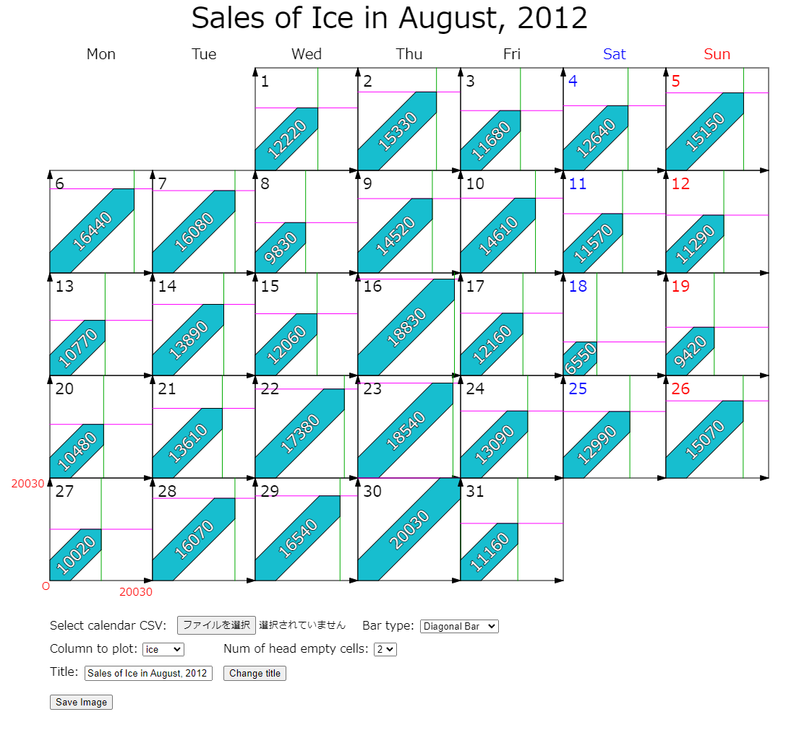
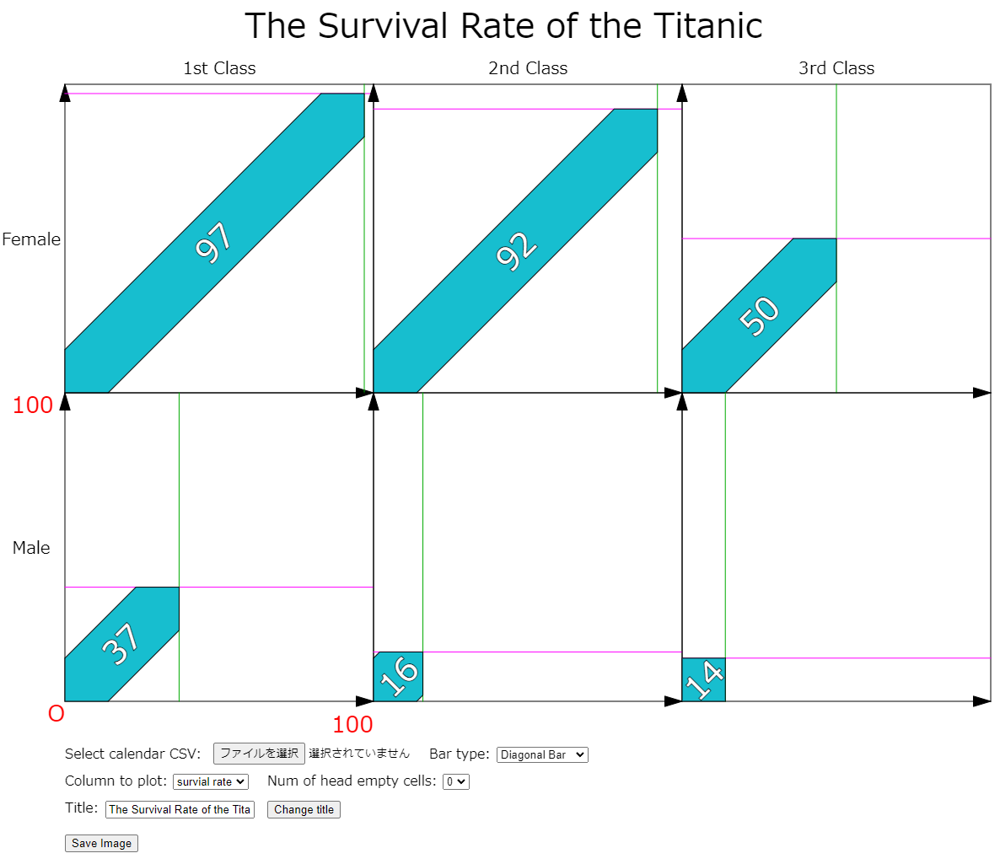
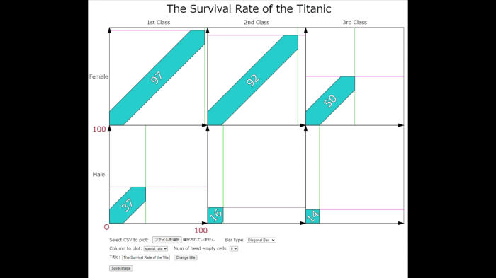

# diagonal-bar-plot
## A bar plot where bars are plotted diagonally to compare values horizontally and vertically at the same time.

By modifying codes, you can plot data like this:

- defaultData.csv is obtained [here](https://github.com/ytakefuji/ensemble-machine-learning/blob/master/ice.csv)
- defaultData2.csv is obtained [here](https://www.kaggle.com/code/ukveteran/pivot-tables-titanic-dataset-jma/notebook) (modified by me)