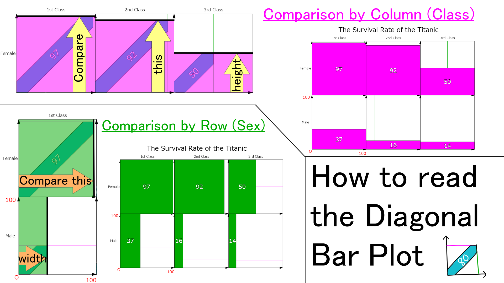

# Diagonal Bar Plot (斜め棒グラフ)
## A bar plot where bars are plotted diagonally to compare values horizontally and vertically at the same time.
You can run codes at [p5.js web edior](https://editor.p5js.org/5246ra/sketches/MVviwFqSO)

By modifying codes, you can plot data like this:

## How to read this plot

- defaultData.csv is obtained [here](https://github.com/ytakefuji/ensemble-machine-learning/blob/master/ice.csv)
- defaultData2.csv is obtained [here](https://www.kaggle.com/code/ukveteran/pivot-tables-titanic-dataset-jma/notebook) (modified by me)